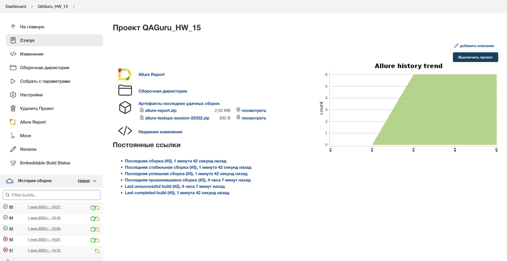
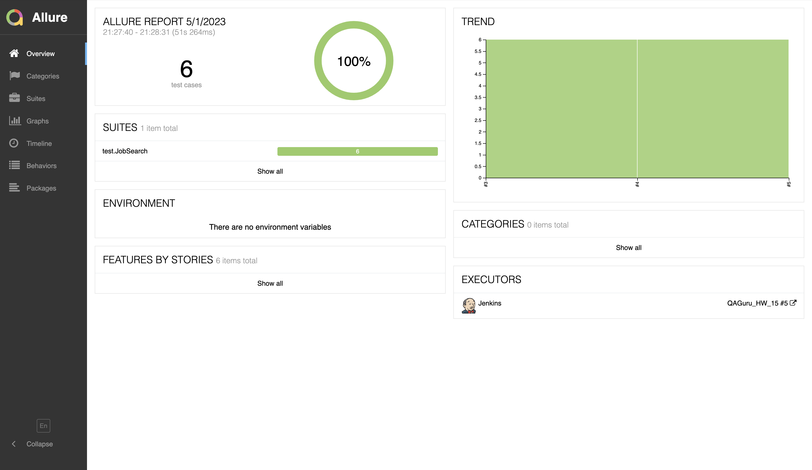
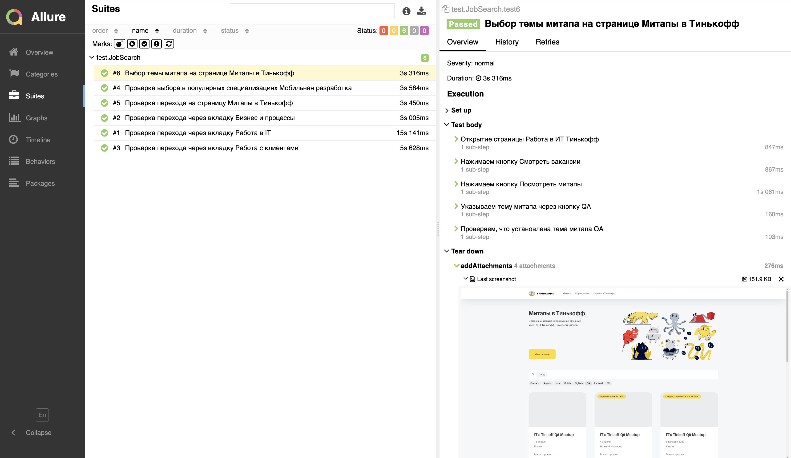
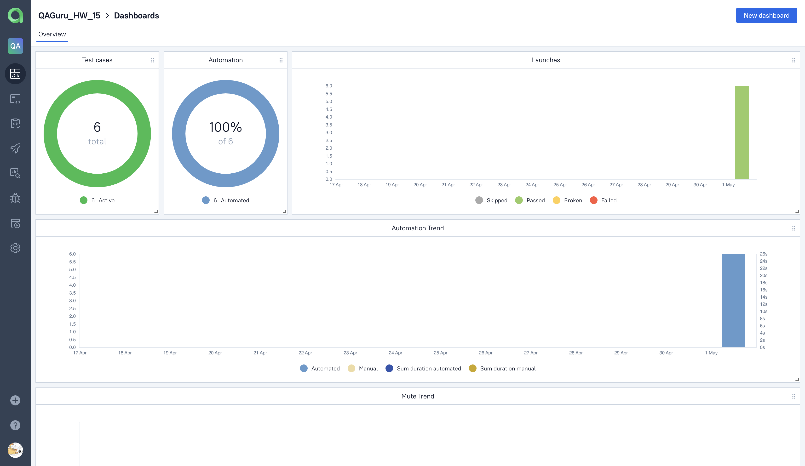
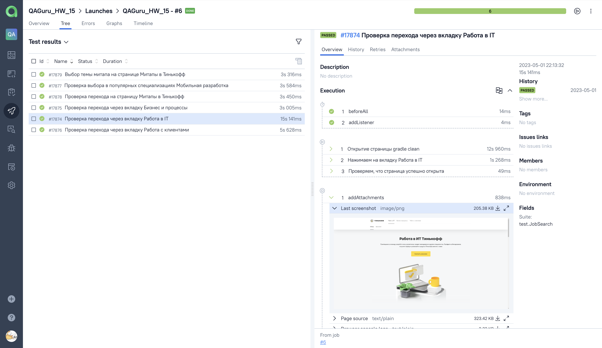
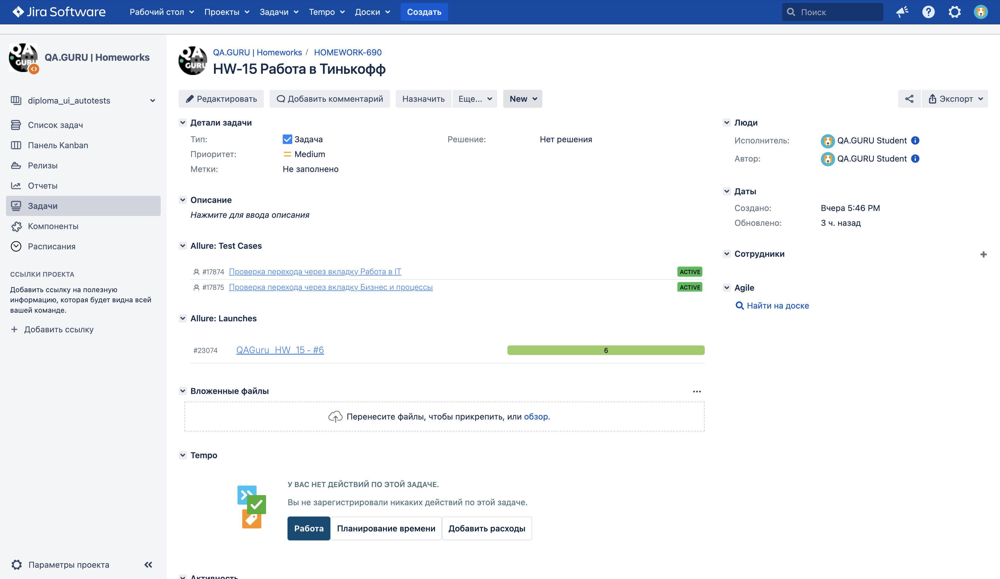
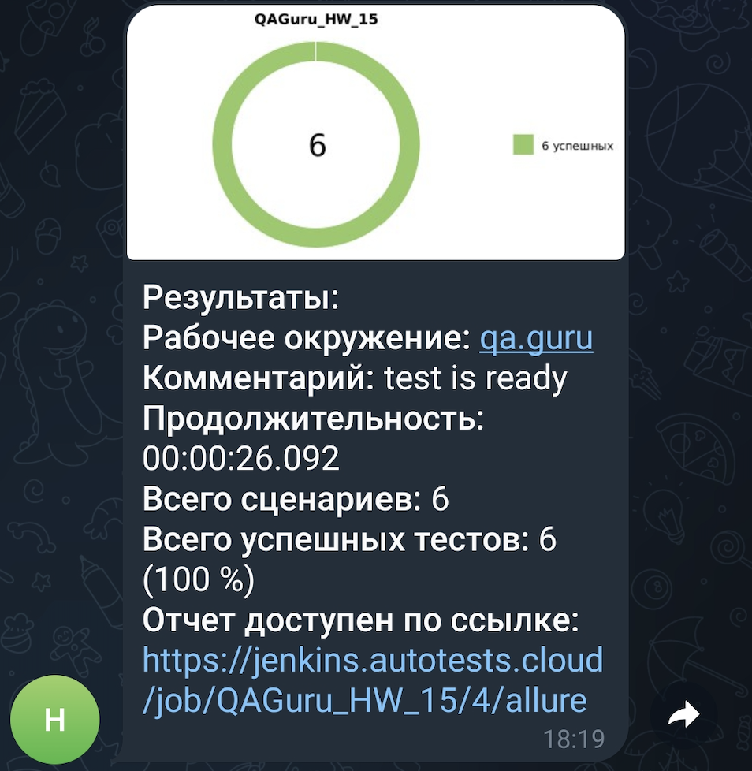
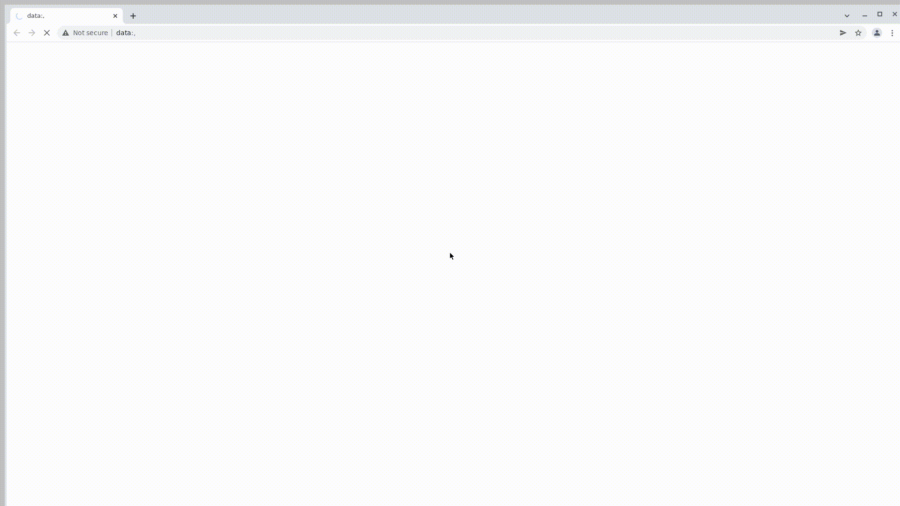

# Проект по автоматизации тестовых сценариев для страницы "Работа в Тинькофф"
____
## Содержание:

- Технологии и инструменты
- Тест-кейсы
- Команды для запуска из терминала
- Cборка в Jenkins
- Allure отчет
- Интеграция с Allure TestOps
- Интеграция с Jira
- Уведомления в Telegram с использованием бота
- Примеры видео выполнения тестов на Selenoid
____
## Технологии и инструменты:

<p align="center">  
<a href="https://www.jetbrains.com/idea/"></a>  
<a href="https://www.java.com/"></a>  
<a href="https://github.com/"></a>  
<a href="https://junit.org/junit5/"></a>  
<a href="https://gradle.org/"></a>  
<a href="https://selenide.org/"></a>  
<a href="https://aerokube.com/selenoid/"></a>  
<a href="ht[images](images)tps://github.com/allure-framework/allure2"></a> 
<a href="https://qameta.io/"></a>   
<a href="https://www.jenkins.io/"></a>  
<a href="https://www.atlassian.com/ru/software/jira/"></a>  
</p>
Тесты в данном проекте написаны на языке <code>Java</code>, сборщик - <code>Gradle</code>. Так же были использованы фреймворки <code>JUnit 5</code> и <code>Selenide</code>.
При прогоне тестов браузер запускается не локально, а в <code>Selenoid</code>.
Для удаленного запуска реализована джоба в <code>Jenkins</code> с формированием Allure-отчета и отправкой результатов в <code>Telegram</code> при помощи бота. Так же реализована интеграция с <code>Allure TestOps</code> и <code>Jira</code>.

____

## Тест-кейсы:
- *Проверка перехода через вкладку 'Работа в IT'*
- *Проверка перехода через вкладку 'Бизнес и процессы'*
- *Проверка перехода через вкладку 'Работа с клиентами'*
- *Проверка выбора в популярных специализациях Мобильная разработка*
- *Проверка перехода на страницу 'Митапы в Тинькофф'*
- *Выбор темы митапа на странице 'Митапы в Тинькофф'*

____

## Команды для запуска из терминала

***Локальный запуск:***
```bash  
gradle clean test
```

***Удалённый запуск через Jenkins:***
```bash  
clean test
-Dbrowser="${BROWSER}"
-DbrowserVersion="${BROWSERVERSION}"
-DbrowserSize="${BROWSERSIZE}"
-DbaseUrl="${BASEURL}"
-DselenoidUrl="${SELENOIDURL}"
```

____

## Сборка в Jenkins
<p align="center">  
</a>  
</p>

____

## Allure отчет
### Основная страница
<p align="center">  
</a>  
</p>  

### *Тест-кейсы*
<p align="center">  
  
</p>

____

## Интеграция с Allure TestOps
### Dashboards

<p align="center">  
  
</p>

### Результат выполнения автотеста

<p align="center">  
  
</p>

____

## Интеграция с Jira

<p align="center">  
  
</p>

____

## Уведомления в Telegram с использованием бота

<p align="center">  
  
</p>

____

## Примеры видео выполнения тестов на Selenoid

<p align="center">
   
</p>